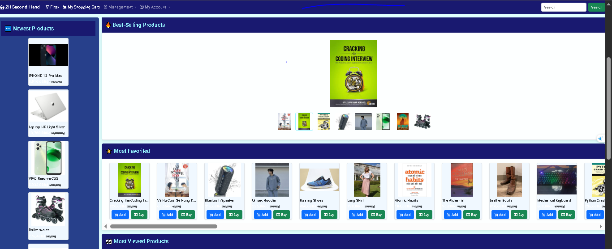

# 🛍️ SecondHand Sales Management Website Supabase

**Link Deploy Website**: (https://graceful-profiterole-21b706.netlify.app/)

## 📖 Project Overview
<p align="center">
  
  </br>
  
  </br>
   
  </br>
  
  </br>
  
</p>


**2H Second-Hand** is a web-based online marketplace designed to provide an intuitive platform for buying and selling pre-owned products. This project leverages the power of **Supabase** for robust data storage and user authentication, ensuring a fast and secure shopping experience.

The primary goal of this platform is to create a user-friendly environment where individuals can easily discover, browse, manage their shopping carts, and complete transactions for second-hand items. It also incorporates essential management features for administrators and managers to oversee products and orders.

## ✨ Key Features

* **Dynamic Homepage:** Showcases best-selling, most favorited, and newest products.
* **Product Categorization:** Allows users to filter products by categories for easier navigation.
* **Product Search:** Integrated search bar enables quick product discovery.
* **Product Details Page:** Dedicated pages for each product with detailed information, images, and options to add to cart or buy directly.
* **Shopping Cart Management:** Users can add, remove, and update quantities of items in their cart.
* **User Authentication (Supabase Auth):** Secure sign-up, sign-in, and session management.
* **Role-Based Access Control:**
    * **Guest:** Browse products, search, view details.
    * **User (Customer):** Add to cart, make purchases, manage personal account.
    * **Manager:** Manage categories, products, orders, and order items.
    * **Admin:** Full administrative control over user accounts, categories, products, orders, and order items.
* **Product Pagination:** Supports pagination for large product listings (e.g., Most Viewed Products) to enhance performance and user experience.
* **Responsive Design:** Ensures optimal viewing and interaction across various devices (desktops, tablets, mobile phones) using Bootstrap 5.
* **Supabase Integration:** Utilizes Supabase as a Backend-as-a-Service (BaaS) for its PostgreSQL database and authentication services, enabling rapid development and scalability.

## 🚀 Technologies Used

* **Frontend:**
    * HTML5
    * CSS3 (with custom `style.css`)
    * JavaScript (ES6+)
    * **Bootstrap 5.3.3:** Popular CSS framework for responsive layouts.
    * **Bootstrap Icons 1.11.3:** Icon library.
    * **jQuery 3.7.1:** JavaScript library for DOM manipulation and AJAX.
* **Backend & Database:**
    * **Supabase:**
        * **Supabase Auth:** User authentication system.
        * **Supabase PostgreSQL:** Relational database for storing product, category, user, order, etc., data.
        * **Supabase Storage:** For storing product images.

## 🛠️ Setup and Installation

To get this project up and running on your local machine, follow these steps:

### 1. Supabase Preparation

1.  **Create a New Supabase Project:**
    * Visit [Supabase](https://supabase.com/) and sign in/sign up.
    * Create a new project.
    * In your project settings, find your **Project URL** and **Anon Public Key** (under `Settings > API`). You will need these.

2.  **Set up Database Schema:**
    * Create the necessary tables in Supabase according to your data structure (e.g., `tbl_products`, `tbl_categories`, `tbl_users`, `tbl_orders`, `tbl_order_items`). Ensure column names and data types match how your application interacts.
    * Example minimum required tables:
        * `tbl_categories`: `categoryid (uuid, PK)`, `categoryname (text)`
        * `tbl_products`: `productid (uuid, PK)`, `productname (text)`, `price (numeric)`, `discount (integer)`, `image (text, URL to Supabase Storage)`, `description (text)`, `categoryid (uuid, FK)`, `purchasecount (integer)`, `favoritecount (integer)`, `view (integer)`.
    * **Important:** Enable Row Level Security (RLS) for your tables and define appropriate policies to control data access based on user roles (user, manager, admin).

3.  **Configure Supabase Storage:**
    * Create a bucket to store product images (e.g., `product-images`).
    * Configure access policies for this bucket (e.g., public read).

4.  **Create Local Supabase Config File:**
    * Inside the `inc` folder of your project, create a file named `config.js` (if it doesn't exist).
    * Add the following code to `config.js`, replacing the placeholders with your actual Supabase information:
        ```javascript
        // inc/config.js
        import { createClient } from '[https://cdn.jsdelivr.net/npm/@supabase/supabase-js/+esm](https://cdn.jsdelivr.net/npm/@supabase/supabase-js/+esm)';

        const SUPABASE_URL = 'YOUR_SUPABASE_PROJECT_URL'; // Replace with your Supabase Project URL
        const SUPABASE_ANON_KEY = 'YOUR_SUPABASE_ANON_KEY'; // Replace with your Supabase Anon Public Key

        export const supabase = createClient(SUPABASE_URL, SUPABASE_ANON_KEY);
        ```

### 2. Local Project Setup

1.  **Clone the Repository:**
    ```bash
    git clone [https://github.com/hkhuang07/Sales-Management-Website-Supabase.git](https://github.com/hkhuang07/Sales-Management-Website-Supabase.git)
    cd Sales-Management-Website-Supabase
    ```

2.  **Open the Project:**
    Open the project folder in your preferred code editor (e.g., VS Code).

3.  **Run on a Local Server:**
    Since this is a purely frontend application with JavaScript, you will need a local web server to run it (to avoid CORS issues when loading ES6 modules).
    * **Option 1 (Easiest): Use VS Code Live Server Extension.**
        * Install the "Live Server" extension by Ritwick Dey.
        * Open the `index.html` file in VS Code, then right-click and select "Open with Live Server".
    * **Option 2: Python HTTP Server.**
        * Open your terminal in the root directory of the project.
        * Run the command: `python -m http.server` (for Python 3) or `python -m SimpleHTTPServer` (for Python 2).
        * Access `http://localhost:8000` (or the port displayed in your terminal) in your web browser.

## 🖥️ Project Structure
Sales-Management-Website-Supabase
├── css/style.css            # Custom CSS

├── images/                  # Directory for static images (e.g., logo, placeholders)

├── inc/config.js            # Supabase configuration file (critical)

├── inc/footer.html          # HTML for the footer (included dynamically)

├── inc/ navbar.html          # HTML for the navigation bar (included dynamically)

├── account.html             # User account management page

├── buynow.html              # Instant purchase page

├── cart.html                # Shopping cart page

├── cart_add.html            # Logic for adding items to cart

├── categories.html          # Category management page (for admin/manager)

├── filter.html              # Page to display filtered/searched products

├── index.html               # Main homepage of the application

├── order-items.html         # Order item management page

├── orders.html              # Order management page

├── product_details.html     # Product details page

├── products.html            # Product management page (for admin/manager)

├── search.html              # Search results page

├── signin.html              # Sign-in page

├── signout.html             # Sign-out logic

├── signup.html              # Sign-up page

└── README.md                # Project description file

## 🤝 Contributing
Contributions are welcome! If you have any suggestions, improvements, or bug fixes, please feel free to open an "Issue" or submit a "Pull Request."

## 📄 License
This project is licensed under the MIT License. See the LICENSE file for more details.
