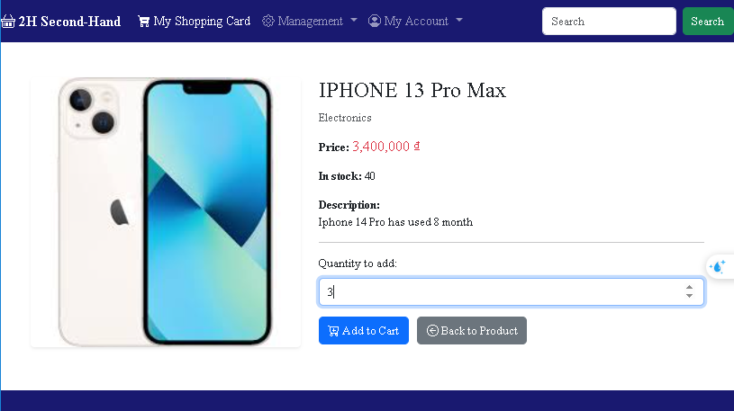

# 🛍️ SecondHand Sales Management Website Supabase

## Link Deploy Website
**2H SecondHand - Sales Management Website**: [https://graceful-profiterole-21b706.netlify.app/](https://graceful-profiterole-21b706.netlify.app/)

---

## 📖 Project Overview

<p align="center">
  
  
  
  
</p>

**2H Second-Hand** is a web-based online marketplace designed to provide an intuitive platform for buying and selling pre-owned products. This project leverages the power of **Supabase** for robust data storage and user authentication, ensuring a fast and secure shopping experience.

The primary goal of this platform is to create a user-friendly environment where individuals can easily discover, browse, manage their shopping carts, and complete transactions for second-hand items. It also incorporates essential management features for administrators and managers to oversee products and orders.

---

## ✨ Key Features

* **Dynamic Homepage:** Showcases best-selling, most favorited, and newest products.
* **Product Categorization:** Allows users to filter products by categories for easier navigation.
* **Product Search:** Integrated search bar enables quick product discovery.
* **Product Details Page:** Dedicated pages for each product with detailed information, images, and options to add to cart or buy directly.
* **Shopping Cart Management:** Users can add, remove, and update quantities of items in their cart.
* **User Authentication (Supabase Auth):** Secure sign-up, sign-in, and session management.
* **Role-Based Access Control:**
    * **Guest:** Browse products, search, view details.
    * **User (Customer):** Add to cart, make purchases, manage personal account.
    * **Manager:** Manage categories, products, orders, and order items.
    * **Admin:** Full administrative control over user accounts, categories, products, orders, and order items.
* **Product Pagination:** Supports pagination for large product listings (e.g., Most Viewed Products) to enhance performance and user experience.
* **Responsive Design:** Ensures optimal viewing and interaction across various devices (desktops, tablets, mobile phones) using Bootstrap 5.
* **Supabase Integration:** Utilizes Supabase as a Backend-as-a-Service (BaaS) for its PostgreSQL database, authentication services, and storage, enabling rapid development and scalability.

---

## 📸 Visualizations

Here's a glimpse of the website's functionalities:

<p align="center">
  <h3>Filtering and Searching Products</h3>
  
  
  <br>
  <em>Easily filter products by category or use the search bar to find specific items.</em>
</p>

<p align="center">
  <h3>Shopping Cart Interactions</h3>
  
  
  <br>
  <em>Add products to your cart and manage quantities effortlessly.</em>
</p>

<p align="center">
  <h3>Product Details and Quick Purchase</h3>
  
  
  <br>
  <em>View comprehensive product information, and proceed to checkout or use the "Buy Now" option.</em>
</p>

<p align="center">
  <h3>Product and Category Management (Admin/Manager Views)</h3>
  
  
  <br>
  <em>Managers and Admins have dedicated interfaces to manage product listings and categories.</em>
</p>

<p align="center">
  <h3>Order Management and Details (Admin/Manager Views)</h3>
  
  
  <br>
  <em>Oversee all placed orders and delve into specific order item details.</em>
</p>

<p align="center">
  <h3>User Management and Profile Settings</h3>
  
  
  <br>
  <em>Admins can manage user accounts, while all users can update their profiles.</em>
</p>

<p align="center">
  <h3>Buy Now & Checkout Process</h3>
  
  
  <br>
  <em>Streamlined processes for instant purchases and completing orders.</em>
</p>

<p align="center">
  <h3>Error Pages</h3>
  
  
  <br>
  <em>Custom error pages for "Not Found" (404) and "Forbidden" (403) access.</em>
</p>

---

## ⚙️ Core Modules and Their Management

This section details the key functionalities and how different entities are managed within the application.

### Authentication, Account & Profile
The website uses **Supabase Authentication** for secure user management.
* **Authentication (SignIn/SignUp/SignOut):** Users can securely register (`signup.html`), log in (`signin.html`), and log out (`signout.html`) using their email and password. Supabase handles the user session management, password hashing, and email verification processes. This ensures that user data is protected and access is controlled.
* **Account (`account.html`):** Authenticated users can access their account page to view and update their personal information such as full name, email, and potentially their profile picture. This ensures users have control over their data.
* **User Management (`usermanager.PNG` - Admin Only):** For administrators, there is a dedicated "Accounts" management page where they can view a list of all registered users, manage their roles (e.g., change a user to a manager or admin), and perform other administrative actions like deleting user accounts. This robust control ensures proper access levels across the platform.

### Products
Comprehensive management of products is crucial for an e-commerce platform.
* **Product Listing (`index.html`, `filter.html`, `search.html`):** Products are displayed across various pages. The homepage highlights best-selling, most favorited, and newest products. Users can browse all products, filter them by category, or use the search bar for specific items. Products include details like name, price, discount, image, description, and counts for purchases, favorites, and views.
* **Product Details (`product_details.html`):** Each product has a dedicated page providing rich details, including multiple images, a full description, original price, discounted price, and options to add to cart or buy immediately.
* **Product Management (`products.html` - Admin/Manager Only):** Users with "manager" or "admin" roles can access a dedicated page to perform **CRUD (Create, Read, Update, Delete)** operations on products. They can add new products, modify existing product information (name, price, quantity, description, image URL), and remove products from the catalog. **Supabase Storage** is utilized here to efficiently store and retrieve product images, allowing for scalable image hosting.

### Categories
Organizing products into categories enhances user experience and management efficiency.
* **Category Management (`categories.html` - Admin/Manager Only):** Similar to products, managers and administrators have access to a page where they can perform **CRUD** operations on categories. This allows for adding new categories (e.g., "Smartphones," "Laptops"), updating existing category names, and deleting categories when no longer needed. Proper categorization ensures that products are easily discoverable.

### Cart & Checkout
The shopping experience is streamlined with intuitive cart and checkout flows.
* **Shopping Cart (`cart.html`, `cart_add.html`):** Regular users can add products to their shopping cart. The cart page allows users to view all selected items, adjust quantities, and remove items. The system dynamically calculates the total price, considering discounts.
* **Buy Now (`buynow.html`):** For a faster purchase experience, users can opt to "Buy Now" directly from a product details page. This bypasses the multi-item cart and takes them directly to a simplified checkout process for that single item.
* **Checkout (`checkout.html`):** Once users are ready to complete their purchase, the checkout page guides them through providing necessary shipping information and confirming their order. Upon successful checkout, the order is recorded in the database.

### Orders & Order Items
Robust order management is essential for tracking sales.
* **Order List (`orders.html` - Admin/Manager/User):**
    * **Admin/Manager:** Can view a comprehensive list of all orders placed on the platform, providing an overview of sales activity. They can track order status and manage order fulfillment.
    * **Regular User:** Can view their personal order history, reviewing past purchases and their current status.
* **Order Items (`order-items.html` - Admin/Manager Only):** This page allows managers and administrators to view the detailed items within each order. This helps in verifying what products were part of a specific transaction, their quantities, and prices, aiding in inventory and fulfillment.

---

## 🚀 Technologies Used

* **Frontend:**
    * HTML5
    * CSS3 (with custom `style.css`)
    * JavaScript (ES6+)
    * **Bootstrap 5.3.3:** Popular CSS framework for responsive layouts.
    * **Bootstrap Icons 1.11.3:** Icon library.
    * **jQuery 3.7.1:** JavaScript library for DOM manipulation and AJAX.
* **Backend & Database:**
    * **Supabase:** A powerful open-source Firebase alternative.
        * **Supabase Auth:** Provides secure user authentication, handling user registration, login, and session management.
        * **Supabase PostgreSQL:** A scalable, relational database for storing all application data (products, categories, users, orders, order items).
        * **Supabase Storage:** Used for efficiently storing and serving product images, handling file uploads and access permissions.

---

## 🛠️ Setup and Installation

To get this project up and running on your local machine, you'll need to set up a Supabase project and then configure the frontend.

### 1. Supabase Preparation (Crucial Step for Your Own Project)

This project relies heavily on Supabase for its backend. If you want to use this website with your own data, you **must** set up your own Supabase project.

1.  **Create a New Supabase Project:**
    * Visit [Supabase](https://supabase.com/) and sign in/sign up.
    * Click "New project" and follow the prompts to create a new project. Choose a strong database password.
    * Once your project is created, navigate to `Project Settings > API`. Here, you will find your **Project URL** and **Anon Public Key**. Keep these handy, as you'll need them in the next step.

2.  **Set up Database Schema:**
    * In your Supabase project, go to the "Table Editor" or "SQL Editor". You'll need to create tables that match the application's data structure. Here are the essential tables:

        * **`tbl_categories`**:
            * `categoryid` (UUID, Primary Key)
            * `categoryname` (TEXT)

        * **`tbl_products`**:
            * `productid` (UUID, Primary Key)
            * `productname` (TEXT)
            * `price` (NUMERIC)
            * `discount` (INTEGER, default 0)
            * `image` (TEXT, stores URL to Supabase Storage)
            * `description` (TEXT)
            * `categoryid` (UUID, Foreign Key referencing `tbl_categories.categoryid`)
            * `purchasecount` (INTEGER, default 0)
            * `favoritecount` (INTEGER, default 0)
            * `view` (INTEGER, default 0)

        * **`tbl_users`**:
            * `userid` (UUID, Primary Key, references `auth.users.id`)
            * `full_name` (TEXT)
            * `avatar_url` (TEXT)
            * `role` (TEXT, e.g., 'user', 'manager', 'admin') - **Important: Set default role to 'user' for new registrations.**
            * *Note: Other user-related fields like email and password are handled by Supabase Auth directly.*

        * **`tbl_orders`**:
            * `orderid` (UUID, Primary Key)
            * `userid` (UUID, Foreign Key referencing `tbl_users.userid` or `auth.users.id`)
            * `order_date` (TIMESTAMP WITH TIME ZONE, default `now()`)
            * `total_amount` (NUMERIC)
            * `status` (TEXT, e.g., 'pending', 'completed', 'shipped')

        * **`tbl_order_items`**:
            * `order_item_id` (UUID, Primary Key)
            * `orderid` (UUID, Foreign Key referencing `tbl_orders.orderid`)
            * `productid` (UUID, Foreign Key referencing `tbl_products.productid`)
            * `quantity` (INTEGER)
            * `price_at_purchase` (NUMERIC)

    * **Enable Row Level Security (RLS):** For each table, enable RLS and define appropriate policies to control data access based on user roles and authentication status. This is crucial for security.
        * **Example Policy for `tbl_products` (Read Access for All, Write Access for Admins/Managers):**
            * `CREATE POLICY "Enable read access for all users" ON "public"."tbl_products" FOR SELECT USING (true);`
            * `CREATE POLICY "Enable insert for authenticated users with admin/manager role" ON "public"."tbl_products" FOR INSERT WITH CHECK ((auth.uid() IS NOT NULL) AND (EXISTS ( SELECT 1 FROM auth.users WHERE (users.id = auth.uid()) AND (users.raw_user_meta_data ->> 'role'::text IN ('admin'::text, 'manager'::text)))));`
            * `CREATE POLICY "Enable update for authenticated users with admin/manager role" ON "public"."tbl_products" FOR UPDATE USING ((auth.uid() IS NOT NULL) AND (EXISTS ( SELECT 1 FROM auth.users WHERE (users.id = auth.uid()) AND (users.raw_user_meta_data ->> 'role'::text IN ('admin'::text, 'manager'::text))))) WITH CHECK ((auth.uid() IS NOT NULL) AND (EXISTS ( SELECT 1 FROM auth.users WHERE (users.id = auth.uid()) AND (users.raw_user_meta_data ->> 'role'::text IN ('admin'::text, 'manager'::text)))));`
            * `CREATE POLICY "Enable delete for authenticated users with admin/manager role" ON "public"."tbl_products" FOR DELETE USING ((auth.uid() IS NOT NULL) AND (EXISTS ( SELECT 1 FROM auth.users WHERE (users.id = auth.uid()) AND (users.raw_user_meta_data ->> 'role'::text IN ('admin'::text, 'manager'::text)))));`
        * Adjust policies for `tbl_categories`, `tbl_orders`, `tbl_order_items`, and `tbl_users` based on your access control requirements.

3.  **Configure Supabase Storage:**
    * In your Supabase project, go to "Storage".
    * Create a new bucket (e.g., `product-images`). This bucket will store all your product images.
    * Ensure the access policies for this bucket allow public read access if you want images to be viewable by everyone, and authenticated write access for admins/managers to upload.

4.  **Create Local Supabase Config File:**
    * Inside the `inc` folder of your project, create a file named `config.js` (if it doesn't exist).
    * Add the following code to `config.js`, replacing the placeholders with your actual Supabase information:
        ```javascript
        // inc/config.js
        import { createClient } from '[https://cdn.jsdelivr.net/npm/@supabase/supabase-js/+esm](https://cdn.jsdelivr.net/npm/@supabase/supabase-js/+esm)';

        const SUPABASE_URL = 'YOUR_SUPABASE_PROJECT_URL'; // Replace with your Supabase Project URL (e.g., [https://abcde12345.supabase.co](https://abcde12345.supabase.co))
        const SUPABASE_ANON_KEY = 'YOUR_SUPABASE_ANON_KEY'; // Replace with your Supabase Anon Public Key

        export const supabase = createClient(SUPABASE_URL, SUPABASE_ANON_KEY);
        ```

### 2. Local Project Setup

1.  **Clone the Repository:**
    ```bash
    git clone [https://github.com/hkhuang07/Sales-Management-Website-Supabase.git](https://github.com/hkhuang07/Sales-Management-Website-Supabase.git)
    cd Sales-Management-Website-Supabase
    ```

2.  **Open the Project:**
    Open the project folder in your preferred code editor (e.g., VS Code).

3.  **Run on a Local Server:**
    Since this is a purely frontend application with JavaScript, you will need a local web server to run it (to avoid CORS issues when loading ES6 modules).
    * **Option 1 (Easiest): Use VS Code Live Server Extension.**
        * If you're using VS Code, install the "Live Server" extension by Ritwick Dey.
        * Open the `index.html` file in VS Code, then right-click and select "Open with Live Server".
    * **Option 2: Python HTTP Server.**
        * Open your terminal in the root directory of the project.
        * Run the command: `python -m http.server` (for Python 3) or `python -m SimpleHTTPServer` (for Python 2).
        * Access `http://localhost:8000` (or the port displayed in your terminal) in your web browser.

---

## 🖥️ Project Structure
Sales-Management-Website-Supabase/

```
├── css/
│   └── style.css            # Custom CSS styles for the website.
├── images/
│   ├── logoHKHuang01.jpg    # Website logo.
│   └── (other images)       # Product images, etc.
├── inc/
│   ├── config.js            # Supabase client configuration.
│   ├── auth_admin.js        #
│   ├── auth_check.js        # 
│   ├── auth_login.js        #
│   ├── ping.js              # 
│   ├── ultils.js            # 
│   ├── footer.html          # HTML partial for the website footer.
│   └── navbar.html          # HTML partial for the website navigation bar.
├── favicon.ico              # Website favicon.
├── index.html               # Homepage of the website.
├── products.html            # Displays all products.
├── filter.html              # Displays products filtered by category or all products.
├── product_details.html     # Displays details of a specific product.
├── cart.html                # Shopping cart page.
├── cart_add.html            # Logic for adding items to the cart.
├── buynow.html              # Logic for immediate purchase.
├── signin.html              # User sign-in page.
├── signup.html              # User sign-up page.
├── signout.html             # Logic for user sign-out.
├── account.html             # User account management page.
├── accountmanager.html      # (Admin/Manager) Account management page.
├── categories.html          # (Admin/Manager) Category management page.
├── orders.html              # (Admin/Manager) Order management page.
├── order-items.html         # (Admin/Manager) Order items management page.
└── search.html              # Displays search results.
```
---
## 🤝 Contributing

Contributions are welcome and greatly appreciated! If you have any suggestions for improvements, find bugs, or want to add new features, please feel free to:

* Open an "Issue" to report bugs or suggest enhancements.
* Submit a "Pull Request" with your changes.

---

## 📄 License

This project is licensed under the MIT License. For more detailed information, please refer to the `LICENSE` file in the repository.

---

## 📞 Contact

For any inquiries or further information, you can reach out to:

**Huynh Quoc Huy** - [huykyunh.k@gmail.com](mailto:huykyunh.k@gmail.com)

Project Link: [https://github.com/hkhuang07/Sales-Management-Website-Supabase
